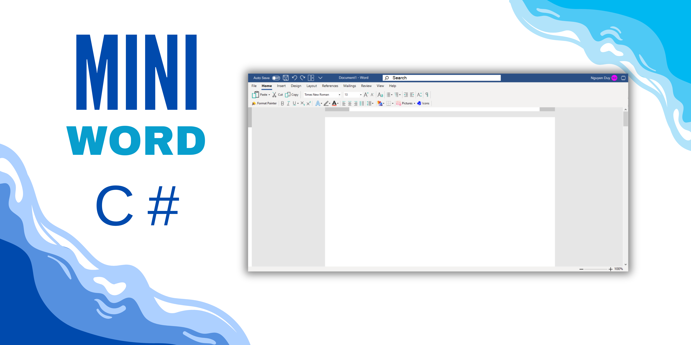

# Mini Word

**Ứng dụng được xây dựng bằng Windows Forms C#**



## Chức năng chính:

1. **Hệ thống thực đơn:**
   - Thực đơn chính và thực đơn ngữ cảnh.
   - Có hỗ trợ hình ảnh minh họa và phím nóng.

2. **Giao diện người dùng:**
   - Thanh công cụ và thanh trạng thái được thiết kế trực quan.
   - Hình ảnh trên thanh công cụ thay đổi theo trạng thái lựa chọn.

3. **Chức năng cơ bản:**
   - **File:**
     - `New`, `Open`, `Save`, `Save As`, `Close`, `Exit`.
   - **Chỉnh sửa:**
     - `Undo`, `Redo`, `Cut`, `Copy`, `Paste` (cả trên menu chính và menu ngữ cảnh).
   - **Định dạng văn bản:**
     - Tô màu chữ và màu nền.
     - Zoom in, Zoom out.
     - Thay đổi font chữ, kích thước, kiểu chữ (nghiêng, đậm, gạch chân hoặc kết hợp).

4. **Tìm kiếm và thay thế:**
   - Tìm kiếm văn bản nhanh chóng.
   - Hỗ trợ thay thế nội dung trong tài liệu.

5. **Chèn nội dung:**
   - Chèn hình ảnh vào văn bản.
   - Chèn biểu tượng (emoji) từ bảng hiển thị.

6. **Thiết kế giao diện:**
   - Giao diện đẹp, thân thiện với người dùng.
   - Phần mềm có tính sáng tạo sẽ được đánh giá cao hơn.

## Huong dan tai file

```bash
 https://github.com/nguyenvanduydev001/mini_word.git
```
## Demo Video
[Youtube](https://youtube.com/@nguyenvanduy2003?si=nYo6tdtugH8DMTUp)